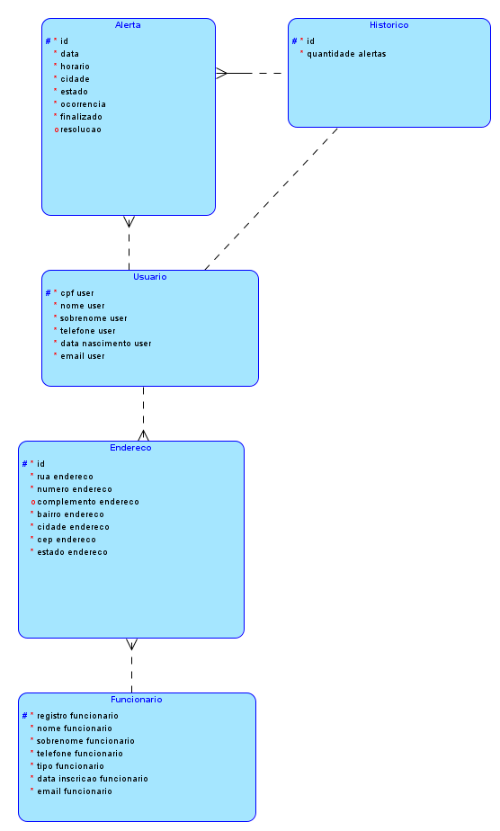
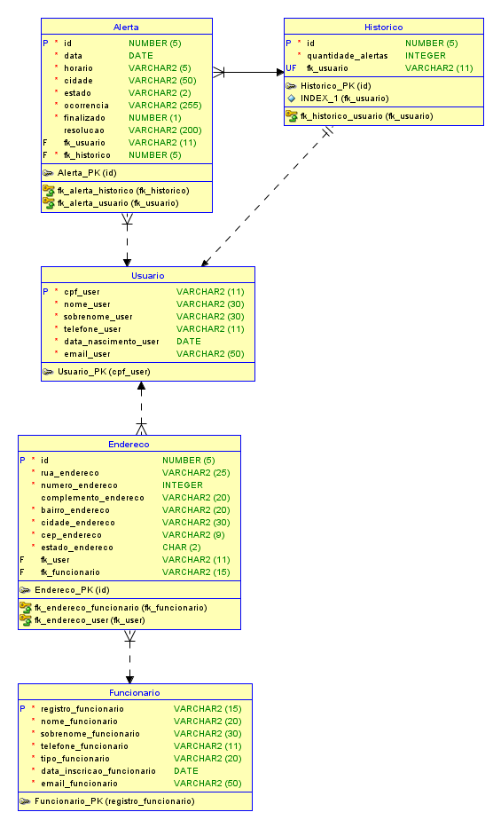

# 🧠 Global Solution: Java Advanced — N.I.M.

O projeto **N.I.M.** visa desenvolver um aplicativo para os usuários possam cadastrar **Alertas** de eventos extremos que estejam presenciando. Desta maneira, sempre que o aplicativo for acessado, um usuário poderá saber se há ou não algo ocorrendo na sua região, impedindo assim que haja um número maior de vítimas e afetados.

---

## 🧪 Dados Iniciais Gerados (DataInitializer)

### 👤 Usuário

| Campo | Valor |
|-------|-------|
| Nome | Teste inicial |
| Sobrenome | Spring |
| CPF | 599.972.590-92 |
| Telefone | 1234567890 |
| E-mail | mariateste.fogolin@example.com |
| Data de nascimento | 01/01/1990 |

> Histórico do usuário é criado automaticamente com 1 alerta.

---

### ⚠️ Alerta

| Campo | Valor |
|-------|-------|
| Evento | Teste de Alerta |
| Gravidade | 3 (moderada) |
| Localização | -23.5505, -46.6333 |
| Data/Hora | gerados em tempo de execução |

---

### 👷 Funcionário

| Campo | Valor |
|-------|-------|
| Nome | João |
| Sobrenome | Silva |
| Registro | 12345678 |
| Tipo | Técnico |
| Telefone | 11 99999-9999 |
| E-mail | joao.silva@example.com |
| Data de inscrição | Data da execução |
| Endereço | Rua Exemplo, Centro, São Paulo - SP, 01001-000 |

---

## 🛡️ Acesso Inicial (Spring Security)

| Usuário | Senha |
|--------|-------|
| admin  | admin123 |

---

## ⚙️ Tecnologias Utilizadas

- **Backend:** Java + Spring Boot
- **Banco de Dados:** Oracle
- **IA/Data Science:** Python (Machine Learning)
- **Aplicativo Móvel:** Kotlin
- **Observabilidade:** Prometheus e Spring Boot Admin

---

## 🔌 Execução com Docker

```bash
docker-compose up --build
docker exec -it ollama ollama pull deepseek-coder
```

### 📈 Ver métricas

Acesse [http://localhost:9090/targets](http://localhost:9090/targets) para verificar os targets do Prometheus.

---

## 🏗️ Modelagem do Banco

### Modelo Lógico  


### Modelo Físico  


---

## 🎥 Demonstração

📹 [Assista no YouTube](https://youtu.be/Ru4kCOUQZBg)

---

## 🤝 Integrantes

- Igor Gabriel Pereira Marcondes — **RM 553544**
- Maria Beatriz Reis Fogolin de Godoy — **RM 552669**
- Nicholas Pereira Paulo Lima Barbosa — **RM 552744**
